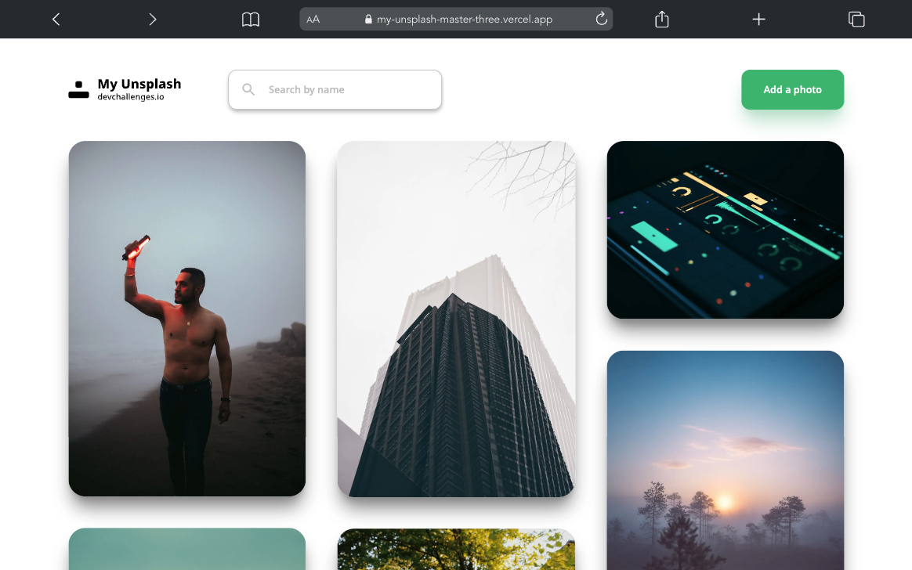

<h1 align="center">My Unsplash</h1>

   Solution for a challenge from  <a href="http://devchallenges.io" target="_blank">Devchallenges.io</a>.

  <h3>
    <a href="https://my-unsplash-master-three.vercel.app/">
      Demo
    </a>
     | 
    <a href="https://github.com/oudajosefu/my-unsplash-master">
      Solution
    </a>
     | 
    <a href="https://devchallenges.io/challenges/rYyhwJAxMfES5jNQ9YsP">
      Challenge
    </a>
  </h3>

<!-- TABLE OF CONTENTS -->

## Table of Contents

-   [Overview](#overview)
    -   [Built With](#built-with)
-   [Features](#features)
-   [Contact](#contact)

<!-- OVERVIEW -->

## Overview

Introduce your projects by taking a screenshot or a gif. Try to tell visitors a story about your project by answering:

-   What was your experience?
    -   This project was really annoying to complete because I tried implementing a search bar's functionality all through React and state management so the state quickly became quite complex. In the future, I would most likely switch out this functionality for something more robust and reliable like the built-in indexing functionality that come with big name databases such as Redis.
-   What have you learned/improved?
    -   I learned a lot about state and how I can use the `useReducer` hook to manage more complex states.
    -   I learned how to implement modals using Headless UI and Tailwind
-   Notes:
    -   I used this project as a way to improve my skills with Next.js and Tailwind. I stumbled upon the problem of how I was going to add a modals for the delete and add photo dialogs so I ended up choosing a Tailwind solution called Headless UI. This library of components allowed me to add Dialog components that act as modals and style them with Tailwind to make them look like modals.
    -   I saw that the project required an api implementation but I didn't think that was necessary because you could just use the Unsplash api. The only api endpoint I ended up making was one that I could call on the client-side which would then make a call to the Unsplash api on the server-side so that it can still have access to the api key's environment variable.
    -   I decided not to make this website responsive so that I can focus more on the Next.js aspect.

### Built With

-   [React](https://reactjs.org/)
-   [Next.js](https://nextjs.org/)
-   [Tailwind](https://tailwindcss.com/)
-   [Headless UI](https://headlessui.com/)

## Features

-   I can see a list of photos in the masonry layout that I have added
-   I can add a new photo to the list - the new photo should be on top of the list
-   I can search for photos by label
-   When I hover a photo, I can see a label and a delete button
-   I can delete images
-   When I delete an image, I can enter my password

This application/site was created as a submission to a [DevChallenges](https://devchallenges.io/challenges) challenge. The [challenge](https://devchallenges.io/challenges/rYyhwJAxMfES5jNQ9YsP) was to build an application to complete the given user stories.

## Contact

-   GitHub [@oudajosefu](https://github.com/oudajosefu)
-   Twitter [@oudajosefu](https://twitter.com/oudajosefu)
